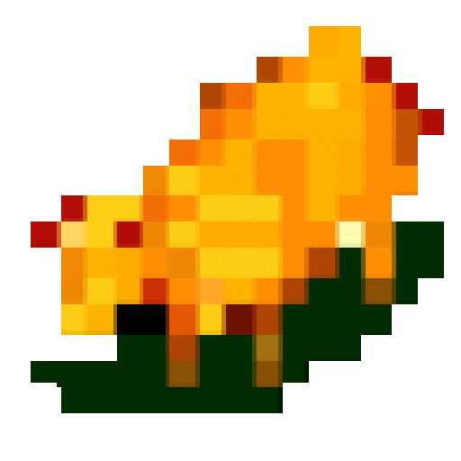

# Polanie CD, portable

This initiative is a portable version of Polanie (CD version 4.27, Poland) based on the original source code provided by Mirosław Dymek—the original author of Polanie—to the editor of polanie.srv.pl. Our main goal is to transform the codebase to achieve platform independence, thereby improving compatibility across different systems while preserving the spirit of the original game as faithfully as possible.

Please note: This project is primarily dedicated to achieving platform independence without interfering with the core gameplay or rewriting the code just for the sake of improvement. Although these are quite worthwhile goals (Polanie multiplayer?), they are not within the scope of this project.

## Status

| Platform | Status                                                                                                                                                    |
| - |-----------------------------------------------------------------------------------------------------------------------------------------------------------| 
| Windows (x86, x64, arm64) |  | 
| MacOS (arm64, x64) |    |
| Linux (x64, arm64) |    |

We are actively working to support more platforms. If you have experience with a particular platform, we encourage you to contribute to `polanie-cd-sdl3`.

## Usage

**An existing copy of Polanie CD is required to use this project. This project is NOT compatible with the floppy disk version of Polanie.**

Detailed information about installing the game can be found on our [Wiki](https://github.com/Pieshka/polanie-cd-sdl3/wiki). In a nutshell—insert the CD into your computer and copy all the folders and .DAT files to your hard drive. You can find instructions on exactly where to place these files on the Wiki.

We do not recommend using ISO disk images, as they do not preserve the original audio tracks with music. Music isn't required for the game to run, but it's nice to have, isn't it?

## Library substitutions

To achieve our goal of platform independence, we need to replace any Windows-only libraries with platform-independent alternatives. This ensures that our codebase remains versatile and compatible across various systems. The following table serves as an overview of major libraries / subsystems and their chosen replacements. For any significant changes or additions, it's recommended to discuss them with the team on the Matrix chat first to ensure consistency and alignment with our project's objectives.

| Library/subsystem              | Substitution                                | Status |
|--------------------------------|---------------------------------------------|--------|
| Filesystem                     | [SDL3](https://www.libsdl.org/)             | ✅     |
| Timer IRQ0                     | [SDL3](https://www.libsdl.org/)             | ✅     |
| Keyboard/Mouse (Input)         | [SDL3](https://www.libsdl.org/)             | ✅     |
| Joystick/Gamepad (Input)       | [SDL3](https://www.libsdl.org/)             | ✅     |
| CD Audio, SoundBlaster (Audio) | [SDL3_mixer](https://www.libsdl.org/)       | ✅     |
| Raw VGA Framebuffer            | [SDL3](https://www.libsdl.org/)             | ✅     |
| playfli library                | [flic-lib](https://github.com/Pieshka/flic) | ✅     |
| DOS Protected Mode Interface   | Default memory allocator                    | -      |

## Building

This project uses the [CMake](https://cmake.org/) build system, which allows for a high degree of versatility regarding compilers and development environments. Please refer to the [GitHub action](/.github/workflows//ci.yml) for guidance.

## Contributing

If you're interested in helping or contributing to this project, check out the [CONTRIBUTING](/CONTRIBUTING.md) page.